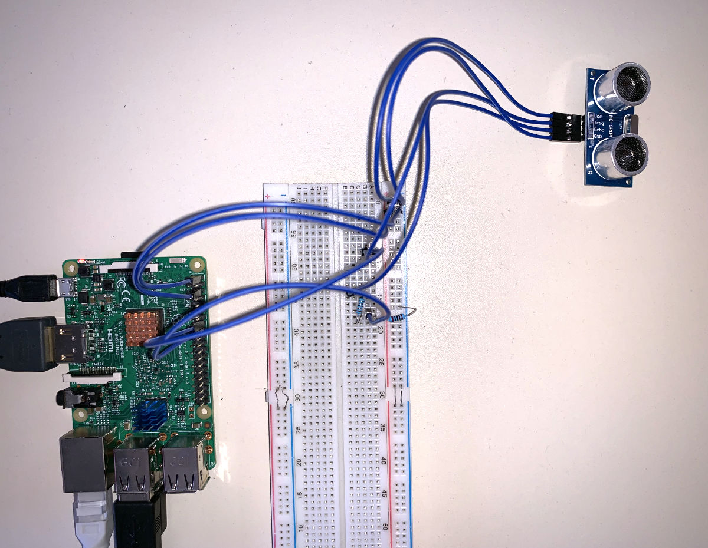
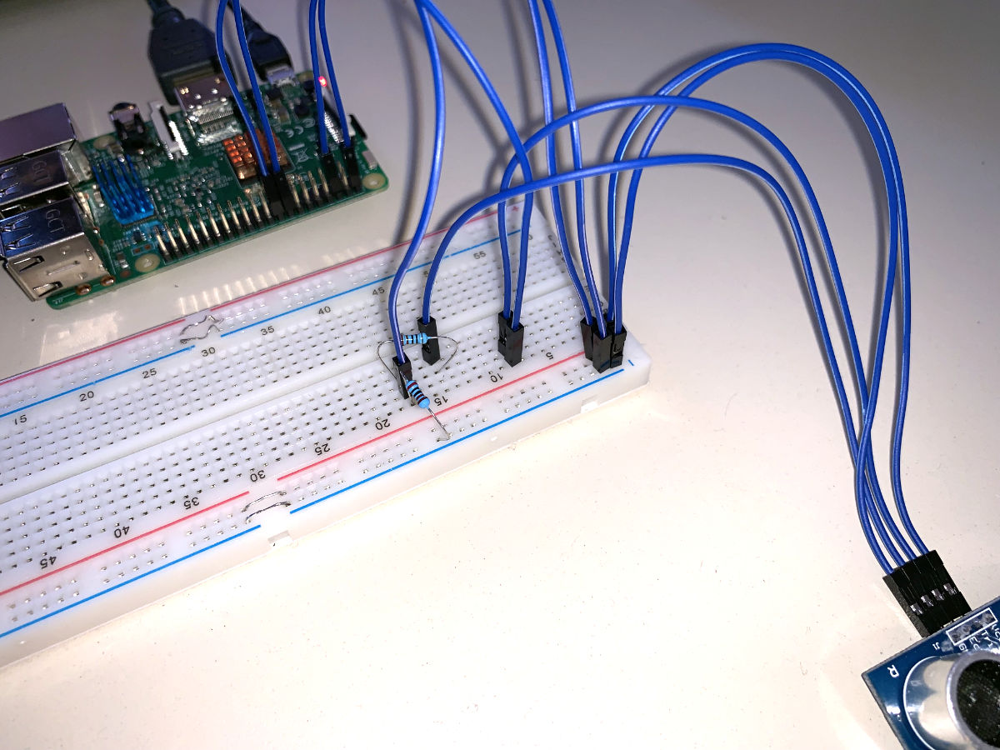

# Simulators

## Use the raspberry simulator

For dev purpose we have created a little python script to send values from an ultrasonic sensor to the dashboard.

### Setup the raspberry

You need an ultrasonic sensor `HC-SR04` a mountig board, one 1kΩ resistor and a 2kΩ resistor. You can fint the monting schemas [here](https://www.modmypi.com/blog/hc-sr04-ultrasonic-range-sensor-on-the-raspberry-pi).




### Use the python script

First you need [python 3](https://www.python.org/) !

Then install the required python depencencies :
* [Rpi.GPIO](https://pypi.org/project/RPi.GPIO/) : `pip install RPi.GPIO`
* [paho-mqtt](https://pypi.org/project/paho-mqtt/) : `pip install paho-mqtt`

Clone the firebrok repo `git clone https://github.com/CPNV-ES/FireBrok.git`.

Now you can edit the `simulators/raspberry/get_distance.py` script to configure it with your firebrok automaton credentials :

```python
# Lines 29-31 in the script

# Fill your credentials
mqtt_c.username_pw_set("myname", "mypass")
# Fill the ip and port of the aggregator
mqtt_c.connect("172.17.101.124", 1883)
```

You can setup a topic name :

```python
# On line 61, you can change the topic name
mqtt_c.publish("mytopicname", distance)
```

You can now run the script, it will automatically connect to the server and start sending data to it.
